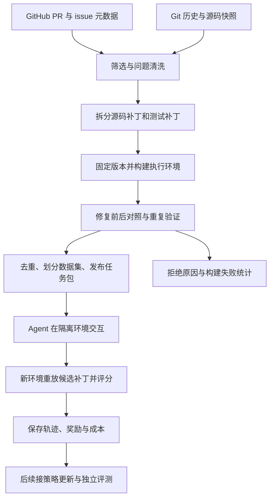

# 本机 RL Coding Env Pipeline 设计

更新：2026-09-27。本文是实施设计，阈值为建议初值。[Lab 04](../labs/04-candidate-discovery/README.md)
已实现 repo 级候选发现与特征提取，[Lab 02](../labs/02-pr-task-compiler/README.md)
已完成首个真实 PR 的 Task Compiler，[Lab 03](../labs/03-agent-harness/README.md)
已接入真实模型并在独立 grader 中产生 reward；通用多语言 builder、批量 task 编排和训练
结果仍未完成。学习顺序见 [Labs 总览](../labs/README.md)。

## 0. 本次截止 9 月 26 日 17:00 的交付范围

先完成 **一个真实 PR 的可交互 RL Env MVP**。不把下文整套长期架构作为两天工作量，也不以人工教学题冒充真实 PR。

| 时段 | 本次做什么 | 暂时后置什么 |
| --- | --- | --- |
| 9/25 上午至 12:00 | Docker Lab 00/01；读 MiMo 接口与 Docker 实现 | 报告全读、MiMo 框架安装、Ray/Kubernetes |
| 9/25 下午和晚间 | 手选一个 PR，固定 B，拆 G/T，构建并做对照 | 通用采集器、LLM 筛选、批量下载 |
| 9/26 上午 | 封装构建/验证入口，修复前后各重复三次，定义 episode 协议 | SQLite 状态机、复杂缓存调度、30–100 题 |
| 9/26 13:30–15:00 | 实现最小环境接口，跑 no-op/gold 两条 episode | 通用多仓库 abstraction、Ray、多机运维 |
| 9/26 15:00–17:00 | 完整重跑、写结果报告并演示；有余量才接 agent | 模型训练、新工具、新候选与功能扩展 |

此处 B 是修复前代码，G 是参考源码修复，T 是验收测试补丁。必须保存 B 的原有测试基线、B + T 的问题失败、B + G + T 的修复成功及回归结果。至少一个稳定 F2P、有 P2P、目标范围内无 P2F；错误补丁和缺失测试不能误报成功。

最小交付目录可以只有一题。P0 不要求先做通用框架，但以下 6 个能力必须真实可执行：

```text
build(task)       固定输入构建无答案镜像
validate(task)    在干净容器中验证 B、B+T、B+G+T
reset(task)       从镜像创建本次 rollout 容器
execute(command)  在该容器中执行动作并返回 observation
finish/grade      导出候选源码 patch，在独立 grader 容器验收并返回 reward
close             回收 rollout 容器
```

建议目录如下；具体文件名可在实现时按仓库调整：

```text
tasks/<task-id>/public/task.json       题目和可公开的环境信息
tasks/<task-id>/private/source.json    PR/issue、准确 SHA、来源与许可
tasks/<task-id>/private/gold.patch     G，仅供构建侧验收
tasks/<task-id>/private/test.patch     T，评分时注入
tasks/<task-id>/build/Dockerfile       明确 COPY 范围，排除 private
tasks/<task-id>/build/dependencies.*   运行时与固定依赖
scripts/build_task.py                 从固定输入构建镜像
scripts/validate_task.py              新容器执行并保存逐测试结果
src/rl_coding_env/environment.py      reset/execute/finish/grade/close
scripts/run_episode.py                从任务记录跑一条 no-op 或 gold episode
artifacts/<run-id>/                   版本、日志、结果、失败归因
reports/first-task.md                 实测结果、重跑方式、未完成项
```

初版允许手工选 PR、审查并拆分补丁；构建、验证和 episode 生命周期需要脚本化，避免依赖手动修改过的容器。JSON 与文件目录足以记录一题，不先引入数据库。没有真实模型轨迹时，no-op 与 gold 是两条控制器驱动的 smoke episode；它们能证明环境接口和奖励闭环，不应表述成 agent 能力结果。

### 0.1 截止时必须能展示的五段证据

| 链路 | 必须展示什么 | 失败时不能怎样掩盖 |
| --- | --- | --- |
| GitHub 来源 | repo、issue/PR URL、原始问题描述、base/head/merge SHA | 不能用自编题或只有 PR 没有清楚需求 |
| Docker image | Dockerfile、基础镜像与最终 image ID/digest、镜像中无 G/T | 不能只在宿主机虚拟环境里跑 |
| Verifier | B 原测健康、B+T 有 F2P、B+G+T 全通过，三次一致 | 不能把未收集测试或 infra error 算 reward=0 |
| RL Env | `reset/execute/finish/grade/close` 的输入输出和独立 grader | 不能在已被手工改过的容器中直接评分 |
| Episode | no-op 的 reward=0、gold 的 reward=1，含动作、观察、patch、测试结果 | 不能只保存最终一行 PASS |

## 1. 推荐路线与第一批仓库

第一版采用 **真实已合并 PR + 关联 issue + 测试变更**，限定 Python、可离线执行的单元测试和小规模 bug fix。本次先完成一个仓库的一题，之后产出 3–5 题，再扩到多个仓库。已有稳定环境后，再做受控 bug 注入。

候选种子：

| 候选仓库 | 适合作为起点的原因 | 入选前仍需验证 |
| --- | --- | --- |
| [more-itertools/more-itertools](https://github.com/more-itertools/more-itertools) | Python 迭代器工具库，仓库中有独立 tests、tox 配置和 MIT 许可 | 历史依赖、真实 bug 修复 PR 的数量、测试时间，以及测试是否能独立定位到问题 |
| [pallets/click](https://github.com/pallets/click) | Python CLI 库，可增加与迭代器不同的错误类型 | locale、终端行为和平台差异，逐题检查 arm64/Linux 可复现性 |

这是候选推荐，没有声称这些仓库已产出合格任务。本次选题限时 45 分钟，固定一题和至多一个备用；批量阶段再预检约 10 个候选 PR 来估计产出率。stars 只是弱信号，测试可复现性更有价值。

不要把任意 open issue 作为第一批主来源：它可能没有足够清楚的期望行为、没有可复现 bug，也没有已知可行解。closed issue 也不必然是已修复，可能是重复或拒绝处理。**优先从已合并 PR 往回找其解决的 issue。**

## 2. 分成三条相接的流水线



- **环境构建线**的产物是任务包、镜像和验证证据，主要消耗 CPU、磁盘和构建时间。
- **采样评分线**的产物是 trajectory + reward，主要消耗模型推理和测试执行资源。
- **训练线**负责更新权重和评测，通常需要独立 GPU 资源以及与推理引擎一致的 token/logprob 处理。

同一任务包可供不同 agent 和训练器使用；构建阶段不依赖某个 RL 算法。

## 3. 构建线各阶段的输入、输出与门槛

### A. 采集元数据与源码

`git clone` 获取代码及提交历史，**不会自动下载 GitHub issue 正文、PR 讨论及关联关系**。使用 GitHub API 或 `gh` 补齐元数据；[官方 PR API](https://docs.github.com/en/rest/pulls/pulls)可读取 PR、提交及文件变更。

保存最小原始记录：repo、issue/PR URL 与编号、标题/正文、created/updated/merged 时间、合并状态、关联依据、base/head/merge SHA、变更文件、许可信息和采集时间。分页请求并缓存结果，保存每个候选的丢弃原因。

问题描述默认来自 issue 初始需求和必要的澄清。排除事后给出答案的评论、完整修复代码、PR diff 和直接提示实现的段落。GitHub 的 issue 正文可能事后编辑；记录其 updated_at，对无法恢复原始状态且疑似泄漏的样本人工检查或丢弃。真实需求中的函数名、接口名可以保留，不能为了“去泄漏”把题目改成无法理解。

一期不自动把所有 PR 描述改写成题目；无关联 issue 的高质量 PR 放入候选扩展池，之后人工确认需求是否独立清晰。

### B. 便宜规则优先，语义判断在后

以下是 **MVP 建议阈值**，需要在试采集后调整：

| 层次 | 保留条件 | 常见拒绝原因 |
| --- | --- | --- |
| Repository | Python，有可运行测试、可检查许可、无需外部生产服务 | 巨大下载、依赖私有服务、重型编译或 GPU |
| PR | 已合并、关联已解决问题，同时含源码与测试变更 | 纯文档、格式化、发布、批量依赖升级 |
| Scope | 一个主要行为问题；先尝试 1–5 个源码文件、源码增删总量 ≤300 行 | 大重构、多个无关修复、测试/源码难以分离 |
| Problem | 说明现状、期望行为、必要输入与约束 | 只写“fix bug”、依赖不可读附件、含答案 |
| Execution | 初始构建预算 10 分钟，测试预算 5 分钟，无需外网业务调用 | 构建/测试超预算、硬编码个人路径 |
| Verification | 至少 1 个稳定 F2P；有 P2P；gold 无新增回归；重复验证一致 | 不复现、参考解不通过、无有效测试、随机失败 |

这些限制服务于本机起步，会偏向小修复；不能把所得任务集称为全部真实软件工程问题的代表。不要硬性只保留带 `bug` 标签的任务，标签既可能缺失也可能误用。

LLM 可辅助判断“问题是否清楚”“测试与需求是否相关”“补丁是否混入无关修改”，输出结构化理由，但最终可执行性必须由真实运行决定。第一批由人工复核筛选误差，并记录 false accept / false reject。

### C. 还原正确的修复前状态

这是最容易悄悄做错的一步：

1. 找到可重放的修复前 `base_commit` 与修复后状态，固定完整 SHA。
2. 普通 merge commit 可以从第一父提交与 merge result 的差异开始检查；**不要统一把 head 的父提交当作 base**。
3. squash/rebase 合并、发生过冲突解决的 PR 需根据真实提交拓扑重建；无法可靠配对时一期丢弃。
4. 不盲用采集时 API 返回的 base 分支最新 SHA。验证目标是保存的补丁能干净地作用于保存的初态。
5. 将补丁分为源码修复 G、测试变更 T；涉及 fixture、内联测试、构建文件或测试专用依赖时由 repo adapter 明确处理，不能只靠文件名里有无 `test`。
6. 比较重建结果与所选修复后状态，保留 tree/diff 摘要，避免把不相关提交混成解答。

PR 里的 test_patch 可能同时修改旧测试和加入新测试；必须确认新旧测试 ID 的对应关系、行为断言与 issue 一致。修改断言来迁就错误行为的测试不应直接成为 oracle。

### D. 固定执行环境

在 Linux 容器内安装项目，宿主机 Python 只做调度。环境记录包括：基础镜像 digest、Python 版本、依赖精确版本/制品摘要、源码 SHA、Dockerfile、安装命令、测试命令、平台、构建日志及镜像 digest。

先写一个 repo adapter：识别安装方式、测试目录、测试框架和结果解析器。测试可能是 pytest 或 unittest，以目标历史版本为准；若使用 pytest 导出 JUnit，也要验证收集的测试与项目原生运行方式相同。

缓存分三层：基础语言镜像 → 依赖层 → 任务源码快照。缓存键至少覆盖基础镜像、运行时、依赖/锁文件、安装脚本、架构。不同历史版本不能仅因 repo 名称相同就强行共享完整环境。可在稳定依赖区间复用层，保存每题自己的精确源码状态。

构建阶段可联网取依赖，完成后测试和 rollout 默认断网。每个 task 用干净快照初始化，依赖包不得偷偷引用 gold checkout 或装入仓库的未来版本。为查看 diff 建立仅含初态的新 Git 仓库，避免将上游未来历史、refs 和远端带入 agent 环境。

### E. 验证并形成可信奖励

沿用 [环境研究中的四组对照](01-research.md#4-验证器是环境质量的核心)，先验证原始测试健康，再验证 B + T 与 B + G + T。

每次输出逐测试记录，包含完整测试 ID、pass/fail/error/skip、时长、错误类型，以及命令退出状态。按相同测试 ID 求 F2P/P2P/P2F，禁止把“测试未收集到”当作修复。MVP 拒绝无法解释的 baseline 失败；未来容许基线已知失败时，必须有单独政策和冻结的清单。

参考补丁、test_patch、测试 ID 及 grader 脚本由控制器保管。正式 agent 可以运行公开旧测试、自己创建测试；最终只导出允许范围内的源码补丁，在新的 grader 容器中执行独立验收。一期只支持纯源码 bug fix，所以可以拒绝候选修改测试/构建配置；未来允许依赖修复等任务时，须定义新的策略而不是静默删掉这些修改。

首批防误判自检至少包括：无修改、gold、错误补丁、删除/跳过测试、伪造成功日志、超时、重置后残留文件。可信评分器检查预期测试集合和执行完整性；读取 agent 工作区现成的 XML 或仅匹配 stdout 中的 PASS 字样不够可靠。

隐藏测试在 agent rollout 时不可见，注入独立 grader 后仍要视候选代码为不可信程序。容器权限与外部结果采集降低篡改风险，但不声称可完全防御恶意代码；需要持续做评分器对抗检查。

### F. 去重、划分和导出

至少按 `(repo, issue/PR)`、归一化补丁、近似描述和修复目标去重。backport、重复 PR、fork、同一原始 bug 的改写或合成变体属于同一组，不能跨 train/dev/test。

- 单仓库阶段：按时间及 bug 家族分组，只能报告该范围内结果。
- 3–5 仓库阶段：预留完整仓库作为 test，开发仓库内用时间/问题族划 dev；记录实际任务分布，不强求 80/10/10。
- 对公开 benchmark 做重叠排查，锁定 held-out 集后不以其反馈调筛选阈值或奖励。
- 这只能控制本项目的数据泄漏，无法证明调用的基础模型从未预训练见过公开 issue。报告中应注明此限制。

导出 public task spec 给 harness；private grader/gold 资产存放在另一位置，**不能因为字段叫 private 就认为同一 JSON 可以完整发给模型**。示意见 [task.example.json](../examples/task.example.json)。

## 4. 本机组件与运行资源

此前核实的机器信息：M4 Pro、14 核 CPU、48 GiB RAM、arm64；Python 3.11.12 可用，Docker CLI 28.4.0 已连接 Colima 中的 Docker Engine 29.5.2（linux/arm64），Lab 00/01 已验证。本机统一使用 Colima 提供 Linux VM 与 Docker daemon，不依赖 Docker Desktop。执行前仍用 `colima status` 和 `docker version` 检查 Server，因为运行时状态会变化。

| 组件 | 建议实现 | 起步理由 |
| --- | --- | --- |
| Collector | Python + GitHub API / gh + git | 逻辑透明，可缓存及断点恢复 |
| Metadata store | 本次 JSON；批量阶段再用 SQLite | 一题先用文件追踪，之后补状态查询 |
| Artifacts | JSONL + 文件目录 | 便于审阅、导出和追踪原始日志 |
| Local runtime | Colima（Linux VM + Docker daemon） | macOS 上纯命令行运行 Linux 容器；接口与生产 Docker daemon 一致 |
| Builder | Docker CLI + repo adapters | 镜像可复用，资源边界清楚 |
| Validator | 独立执行器 + JUnit/框架解析器 | 统一奖励口径和故障归因 |
| Agent harness | 固定版本的 [mini-swe-agent](https://github.com/SWE-agent/mini-swe-agent)，或同等简单循环 | 其文档已有容器后端和轨迹记录；要固定 release/commit，不追随 main |
| Model | 已有可用模型 API，或已验证兼容的本地小模型端点 | 先验证环境和任务，不把模型部署变成首个阻塞 |
| Scheduler | 本次串行 Python；后续 worker 队列 | 单题无需调度平台；Ray 为可选并行练习 |
| Trainer | 后续接 verl 等框架的适配器 | 环境协议稳定后再接参数更新 |

本次先串行构建和验证一个任务；教学项目使用 1 CPU / 256 MiB 的小容器。真实仓库从每容器 2 CPU / 4 GiB 的上限开始预检，测量后调整。后续小批量可从 1 个构建 worker、2 个 rollout worker 起步；模型本地推理时需重新分配内存。30–50 GiB 是后续小批量的磁盘预算建议，不是上午小项目的要求，实际使用量需测量。

优先原生 linux/arm64 环境；若某个历史依赖仅支持 amd64，明确记录模拟运行及其速度影响，或将该任务移到 x86 Linux worker。不要把 arm64 的失败误记成任务本身不可解。

模型客户端和 API key 留在控制器进程，工具沙箱不挂载主目录、SSH key、Docker socket 或云凭据；限制网络、CPU、内存、进程数与命令超时。这些是执行任意仓库代码所需的基本环境边界。

## 5. 最小接口与运行记录

P0 的接口形状如下。实现可以是一个只支持当前真实任务的 Python 类，不要求先抽象多个仓库：

```python
reset(task_id, seed) -> observation
execute(command, timeout) -> observation
finish() -> candidate_patch
grade(task_id, candidate_patch) -> grade_result
close() -> None
```

这里不强行伪装成 Gym 的一步一奖励：shell command 的中间奖励通常没有意义，终局 `grade` 才产生任务 reward。`observation` 至少包含 command、stdout/stderr、exit code、duration、timed_out；`grade_result` 至少包含 reward、status、F2P/P2P 逐测试结果、完整性检查和基础设施错误。

`finish` 从 rollout 容器的初始 Git commit 导出候选源码 diff，并拒绝测试、grader、依赖配置等 P0 不允许的修改。`grade` 必须另起干净容器，应用候选 patch 和控制器持有的 T；不能信任 rollout 容器里的测试结果或结果文件。

环境达到总预算时由控制器记录 `truncated=true`；正常提交记 `terminated=true`。统计时区分 agent 命令失败、候选测试失败、模型 API 故障和环境基础设施故障。

P0 用两条固定 episode 做接口验收：

| episode | 动作 | 预期 |
| --- | --- | --- |
| no-op | reset 后直接 finish/grade | patch 为空，F2P 失败，reward=0 |
| gold | reset 后应用 G，再 finish/grade | patch 非空，F2P/P2P 全通过，reward=1 |

这两条不是模型评测，而是环境的单元级验收。只有真实模型根据 issue 自主执行动作，才能称为 agent rollout。

每次 rollout 至少记录：

```text
run_id / task_id / task_version / split
model_id / model_revision_if_available / policy_version
harness_version / tool_protocol_version / prompt_hash / sampling_parameters
image_digest / arch / seed / verifier_version
每轮 messages、actions、observations、tool exit code、时间、输出截断
candidate_patch_hash / per-test results / reward / termination_reason
input_tokens / output_tokens / cached_tokens_if_available / cost / wall_time
```

模型 API 未暴露 revision、seed 或 logprobs 时写 unavailable，不编造可重复性；固定模型名并不意味着供应商永远不更新权重。

真正对接在线 RL 时，还需训练引擎保存或计算准确的 token IDs、训练序列、assistant action token 的 loss mask、行为策略 logprobs、policy version，并管理上下文截断及旧策略样本。工具输出作为观察条件，不应被当成模型生成动作来优化。**外部 API 采集的成功轨迹可以用于评测或 SFT；它们不会自动成为可直接用于当前策略 GRPO 的 on-policy 数据。**

## 6. 状态机、缓存与失败分类

```text
DISCOVERED → FILTERED → SNAPSHOT_READY → BUILT → VERIFIED → PUBLISHED
任何阶段都可进入 REJECTED 或 RETRYABLE_ERROR，并保存原因和证据
```

建议批量阶段将状态持久化到 SQLite；本次一题用 JSON 文件记录即可。每个阶段对相同输入内容及配置幂等。重试限制次数，记录最后一个成功阶段，避免一次网络错误就从 clone 重来，也避免无界 agent 修环境消耗预算。

建议错误码：

```text
NO_LINKED_ISSUE / AMBIGUOUS_REQUIREMENT / ANSWER_LEAK
NO_TEST_PATCH / PATCH_NOT_SEPARABLE / BAD_BASE_COMMIT
DEPENDENCY_UNAVAILABLE / BUILD_TIMEOUT / PLATFORM_UNSUPPORTED
TEST_COLLECTION_ERROR / NO_F2P / GOLD_FAILS / REGRESSION / FLAKY
DUPLICATE / BENCHMARK_OVERLAP
MODEL_API_ERROR / GRADER_INFRA_ERROR / AGENT_BUDGET_EXCEEDED
```

产出漏斗应报告每个阶段分母，例如“采集候选数 → 静态通过数 → 可构建数 → 有效 F2P 数 → 去重后合格数”。

演算示例：200 候选 × 50% 关联有效 × 60% 补丁可用 × 50% 构建成功 × 60% 验收合格 = 18 题。**这些比例是示意，尚未测量**；它说明原始 issue 数与最终环境数之间可能相差很大。用第一批真实数据替换后，才能估计扩容成本。

## 7. 实施顺序和验收标准

| 阶段 | 要做的工作 | 完成标准 |
| --- | --- | --- |
| P0：本次截止 9/26 17:00 | 一个仓库，手工选 PR，脚本化构建 B/G/T；实现最小 RL Env | 验证各重复 3 次；no-op/gold episode 分别 reward=0/1；保存证据与重跑报告 |
| P1：自动生成 | 实现采集、筛选、补丁拆分、构建与状态记录 | 自动产出 3–5 题；失败有原因，可断点恢复 |
| P2：接 agent（可对 P0 的一题提前尝试） | 固定 harness/model，独立 grader | 每题至少一条完整轨迹，记录 patch、reward、成本 |
| P3：后续扩展版 | 扩到 3–5 仓库、30–100 合格任务 | 质量报告、held-out 基线、真实成本和演示流程 |
| P4：扩量实验 | 比较筛选规则，尝试稳定环境中的 bug 注入 | 真实/合成任务分别报告；验证 prompt 与 bug 匹配 |
| P5：训练验证 | 用可训练模型接采样、奖励、策略更新 | 有真实 checkpoint 更新，固定测试集上比较训练前后 |

P0 无需模型调用；先用 no-op 与 gold 验证环境协议和 grader。P2 才涉及模型推理成本。本次有余量可在一题上提前做 P2，不要求先自动产出 3–5 题；若没有可用端点，就如实交付“真实任务 + 可交互 RL Env MVP”，而不是 agent 成功率。教学练习只需 Python 基础镜像，不需要模型权重。

P4 的合成路线：选通过测试的固定快照 → 注入语义错误 → 证明原测试能捕获 → 生成不泄漏修复的需求描述 → 证明反向恢复可修复 → 与真实任务执行同样的质量门槛。不要只制造语法错误或测试文件可见即泄漏答案的任务。

## 8. 规划中的项目结构与命令

下列是长期实现的结构，**当前另有 `labs/00-docker-cli`、`labs/01-docker-python` 教学项目和 `references/mimoagent` 阅读摘录；下面的正式 pipeline 代码尚未实现**。本次先使用第 0 节的一题目录，只实现 `builder.py`、`validator.py`、`environment.py` 和一个 episode 入口，不必创建全部模块：

```text
src/rl_coding_env/
  collector.py       # 元数据与源码
  filters.py         # 候选过滤
  patches.py         # 历史状态重建与补丁拆分
  builder.py         # 镜像及依赖固定
  validator.py       # F2P/P2P/重复验证
  grader.py          # 独立候选评分
  runner.py          # 与 agent harness 连接
  export.py          # 发布任务和训练器适配
  adapters/          # 每仓库安装、测试及解析规则
configs/             # 仓库、资源、过滤配置
data/raw/            # 原始元数据
data/tasks/public/   # 可给 agent 的任务描述
data/tasks/private/  # gold 与 grader 资产；不挂入 agent
artifacts/builds/    # 构建及验证日志
artifacts/rollouts/  # 交互、补丁、评分、成本
reports/             # 漏斗、质量、评测报告
```

长期 CLI 为 `collect → filter → build → validate → export → rollout → report`。P0 只承诺 `build-task → validate-task → run-episode → report`；在代码实际落地前，这些也只是目标名称，不应写进演示作为已完成能力。

## 9. 面试演示应展示什么

本次至少展示：真实 issue/PR → 修复前代码 → 无答案镜像 → 测试复现 → gold 验收 → 新容器重复验证 → 最小 RL Env → no-op/gold reward → 结果报告。若已接入 agent，再展示模型交互、候选补丁和独立评分；未接入就明确说明 episode 是控制器 smoke test，不是模型能力结果。

后续有足够任务与 rollout 后，再用全量报告解释以下指标。一题阶段只给出原始次数、耗时和失败原因，不用少量重复运行声称代表性的成功率或 p95：

- 每阶段保留多少题，主要损失在哪一步。
- 构建成功率、验证合格率、重复一致性、人工抽查问题率。
- 单个合格任务成本，镜像缓存节省，构建/评分 p50 与 p95 时延。
- 固定预算的任务成功率、基础设施故障率、每个成功任务的推理成本。
- 不同 bug 类别、仓库及长度的覆盖，不把单仓库结果外推。
- 同一冻结题集下的一项可解释对照，如规则筛选 vs 加入语义筛选，或弱 grader vs 完整 grader 的误判差异。

运行多次时，分清“单次成功率/avg@k”（平均每次成功率）与“pass@k”（k 次中至少一次成功）。小 held-out 集报告原始成功数、样本数和不确定性，不能用几个百分点变化宣称稳定提升。

这个项目的技术主张应由真实证据支撑：**把不可靠的历史开发记录，转换成可重复执行、能够产生可信奖励的训练任务。**
