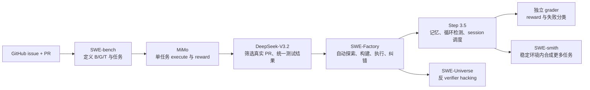

# RL Coding Env 论文导读：从一条真实 PR 到可训练环境

先不要把目标理解成“读懂几份大模型技术报告”。

你现在真正需要回答的问题是：

> 怎样把一条真实 GitHub issue / PR，转换成一个能反复重置、允许 agent 交互、并且给出可信 reward 的 RL coding environment？

假设我们找到一条已经合并的 bug-fix PR。Issue 描述了错误行为，PR 同时修改了源码和测试。构建任务时，需要把它拆成：

```text
B：修复前的代码状态（base）
G：人类参考源码修复（gold patch）
T：能够暴露问题的测试变更（test patch）
```

然后依次证明：

```text
B + 原有测试       -> 基础环境健康
B + T              -> 至少一个目标测试稳定失败
B + G + T          -> 目标测试通过，原有行为不回归
B + Agent patch + T -> 在独立 grader 中得到 reward
```

这条链路正好跨过六个问题：任务定义、PR 数据清洗、环境构建、验证器、agent 交互和规模化调度。没有一篇论文会把六个问题都讲清楚，所以需要按问题组合阅读，而不是按模型发布时间通读。

本文沿用 `step-prepare/resources/01_papers/reading_guide` 的方式：从具体任务出发，先建立全局地图，再看关键机制、数据形态和真实数字，最后回到当前项目。**不会逐章复述完整 technical report。**

核对日期：2026-09-26。Step 3.5、DeepSeek-V3.2 和 SWE-bench 的 PDF 已在 `step-prepare`；其他材料链接到论文原文。报告中的规模和结果均为作者披露，本项目尚未独立复现。

## 1. 先确定读到哪里就够

当前必读是四份论文材料加一份 MiMo 实现导读；另外两份等第一个真实任务闭环后再读。

| 优先级 | 材料                                                                                           | 它只负责回答什么                                      | 建议用时    |
| --- | -------------------------------------------------------------------------------------------- | --------------------------------------------- | ------- |
| P0  | [SWE-bench 中文导读](../../../step-prepare/resources/01_papers/reading_guide/swe_bench_guide.md) | 什么是一道 repo-level 代码任务，怎样用 F2P/P2P 判定修复        | 15 分钟复习 |
| P0  | [MiMo 环境接口与 Docker 导读](04-mimo-environment-guide.md)                                   | 已有 Task Image 后，命令怎样执行、T 怎样注入、C 怎样变成 reward | 60 分钟 |
| P0  | [DeepSeek-V3.2 §3.2.2–3.2.3](https://arxiv.org/html/2512.02556v1#S3.SS2.SSS2)              | 四类 agentic task 怎样构建；重点看真实 issue–PR 如何变成 Code Env | 45–60 分钟 |
| P0  | [Step 3.5 §5.3.3–5.4](https://arxiv.org/html/2602.10604v1#S5.SS3.SSS3)                       | 怎样把环境构建变成 agent 能力，并管理长程 coding session       | 20 分钟   |
| P0  | [SWE-Factory §3.2–3.3、§5.1–5.3](https://arxiv.org/html/2506.10954#S3.SS2)                    | 一个自动环境 builder 具体要有哪些角色、反馈回路和产出指标             | 30 分钟   |
| P1  | [SWE-Universe §2.1–2.2](https://arxiv.org/html/2602.02361#S2.SS1)                            | verifier 为什么会被“做成假测试”，怎样在生成环内防 reward hacking | 20 分钟   |
| P2  | [SWE-smith §2.1、Appendix A.3](https://arxiv.org/html/2504.21798#S2.SS1)                      | 有稳定仓库环境后，怎样一环境多任务地生成合成 bug                    | 25 分钟   |

阅读边界：

- 今天先读 P0，目标是帮助完成当前一个真实 PR 的 MVP。
- P1 在 no-op/gold episode 跑通后读，用来加强 verifier。
- P2 在准备从 3–5 个真实任务扩量时读；不要用合成 bug 替代第一个真实 PR。
- 不通读 Step 3.5 或 DeepSeek-V3.2 的模型架构、预训练和完整评测表。

## 2. 七份材料在一条链路中的位置



先固定六个容易混淆的对象：

| 对象                | 含义                     | 当前项目中的形态                                |
| ----------------- | ---------------------- | --------------------------------------- |
| Candidate         | 尚未经过执行验证的 issue–PR 对   | 一条待审查的 GitHub 记录                        |
| Task              | 已定义初态、问题和验收条件的一道题      | `task.json + G + T`                     |
| Environment       | 能执行该任务的固定运行时           | Docker image + cwd + runtime config     |
| Verifier          | 把候选补丁转成结构化判定的程序        | grader + T + 冻结测试 ID                    |
| Episode / rollout | agent 在一个 task 上的一次尝试  | actions + observations + patch + reward |
| Trajectory        | episode 中可用于分析或训练的交互记录 | messages、工具调用、输出、token、耗时               |

论文里出现“50k environments”“50k instances”或“5k trajectories”时，不能把这些口径相互替换。

## 3. 先用一条任务理解数据长什么样

下面是当前项目需要形成的数据形状。字段是项目导读 schema，不声称来自某一篇论文的原始格式：

```json
{
  "source": {
    "repo": "owner/repo",
    "issue_url": "https://github.com/owner/repo/issues/...",
    "pr_url": "https://github.com/owner/repo/pull/...",
    "base_commit": "<full sha>"
  },
  "task": {
    "problem_statement": "<不泄漏答案的问题描述>",
    "gold_patch_sha256": "<G hash>",
    "test_patch_sha256": "<T hash>"
  },
  "runtime": {
    "image_digest": "sha256:...",
    "platform": "linux/arm64",
    "cwd": "/workspace/repo",
    "install_spec_version": "v1"
  },
  "verifier": {
    "command": "python -m pytest --junitxml=/results/junit.xml ...",
    "f2p_test_ids": ["..."],
    "p2p_test_ids": ["..."],
    "parser_version": "junit-v1",
    "timeout_sec": 300
  },
  "episode": {
    "candidate_patch_sha256": "...",
    "reward": 0,
    "status": "valid_evaluation",
    "termination_reason": "submitted"
  }
}
```

阅读后要能指出每篇材料主要改变 schema 的哪一部分：

```text
SWE-bench       -> source / task / verifier
MiMo            -> runtime execution / model patch / reward lifecycle
DeepSeek-V3.2   -> candidate filtering / verifier normalization
SWE-Factory     -> runtime construction / build feedback
Step 3.5        -> builder memory / episode session / concurrency
SWE-Universe    -> verifier quality / anti-hacking
SWE-smith       -> synthetic task generation
```

当前仓库更完整的规划字段见 [task.example.json](../examples/task.example.json) 和 [本机 pipeline 设计](02-local-pipeline.md)。

## 4. 第一份：SWE-bench 定义“什么叫修好了”

### 4.1 为什么它排第一

SWE-bench 的核心贡献不是 coding agent，而是把真实软件修改变成可执行评测：

```text
真实 issue
  + 修复前代码库
  + 候选 patch
  + 目标测试与回归测试
  -> resolved / unresolved
```

如果没有这层定义，后面的自动构建、并发 rollout 和 RL 都只是在放大不可靠信号。

### 4.2 只复习这些部分

直接读现有 [SWE-bench 中文导读](../../../step-prepare/resources/01_papers/reading_guide/swe_bench_guide.md) 的第 2、4、5、10 节：

- 一道题由 issue、历史代码状态和 patch 构成。
- `FAIL_TO_PASS` 检查目标问题是否修复。
- `PASS_TO_PASS` 检查原有行为是否回归。
- 模型 patch 可应用，不代表行为正确。
- 论文原始漏斗从 93,139 个 PR，经规则转换得到 11,407 个候选，执行验证后剩 2,294 个任务。

最后一个数字的意义不是“我们的产出率也应是 2.46%”，而是：

> GitHub 元数据量远大于真正可执行、可判分的任务量，必须保存每阶段分母和拒绝原因。

### 4.3 回到当前项目

当前项目在 SWE-bench 基础上再加三条更严格的工程约束：

1. B、B+T、B+G+T 分别在干净环境重复执行，不能只成功一次。
2. 不只看整体退出码，还要冻结并解析逐测试 ID，确认 F2P/P2P 集合真的出现。
3. 正式评分在新的 grader 容器中重放 candidate patch，不信任 agent 工作容器里的结果。

读完应能回答：

- 为什么 gold patch 不应该交给解题 agent？
- 为什么“测试命令 exit 0”仍可能是假成功？
- 为什么删除测试、全部 skip、零测试不能得到 reward=1？

## 5. 第二份：MiMo 把任务定义落成一次 episode

SWE-bench 先定义了 B/T/G/C 和 resolved，但没有负责把 agent 的每条 shell command 接到一个持续容器中。MiMo 正好是两者之间的实现桥梁。

只读 [MiMo 环境导读](04-mimo-environment-guide.md) 和本地四份源码：

```text
docker.py
datasets/base.py
datasets/opensource_code.py
datasets/__init__.py
```

第一遍只回答：

```text
Task Image 怎样启动成持续容器？
shell action 怎样返回 observation？
C 在什么时候由 git diff 捕获？
T 在什么时候注入，为什么此前不可见？
test_command 的退出码怎样变成 reward？
下一条 rollout 怎样恢复整个初态？
```

MiMo 在这条路径中不负责：

- 从 GitHub 选择 PR；
- 构造 B、拆分 G/T；
- 用 G 验证任务可解；
- 构建 Task Image；
- 自动保证 verifier 的 F2P/P2P 完整性。

所以它应放在 SWE-bench 后面：先知道任务语义，再看运行接口；也应放在 DeepSeek/Factory 前面：先看清一题怎样执行，再理解怎样批量生产大量环境。

## 6. 第三份：DeepSeek-V3.2 怎样构造四类 Agentic Task

本地 PDF：[deepseek\_v3\_2\_2512.02556.pdf](../../../step-prepare/stepfun_llm_data_platform_materials/papers/deepseek_v3_2_2512.02556.pdf)，网页原文：[§3.2 Thinking in Tool-Use](https://arxiv.org/html/2512.02556v1#S3.SS2)。

这部分真正回答的是：

> 为了让模型在 RL 中学习“思考过程中调用工具”，DeepSeek 怎样获得大量可交互、可验证、难度足够的 agentic tasks？

### 6.1 阅读范围与证据边界

必读：

- §3.2.2 `Cold-Start`：reasoning 和 tool-use 最初怎样接起来。
- §3.2.3 `Large-Scale Agentic Tasks` 与 Table 1：四类任务的来源、环境和规模。
- §3.2.3 `Code Agent`：真实 PR 环境生产的全部公开说明。
- §3.2.3 `General Agent`：自动合成 environment/tool/task/verifier 的完整流程。

补充：

- §4.3 `Synthesis Agentic Tasks`：合成 General Agent 任务是否足够难、能否泛化。
- Appendix B Tables 7–8：工具调用的 system prompt 示例。

暂时跳过：

- DSA、GRPO 的公式和训练稳定化细节。
- 完整 benchmark 分数。
- Appendix C/D 的非思考评测与竞赛评测细节。

特别注意：**Appendix 没有继续展开 Code Agent 的 Dockerfile、harness、依赖冻结或 PR 拆分算法。** Code Agent 构建细节基本只有 §3.2.3 的一个段落；下面会严格区分原文事实与工程推导。

### 6.2 四类任务的全局地图

[原文：§3.2.3、Table 1](https://arxiv.org/html/2512.02556v1#S3.T1) 给出：

| 任务 | tasks | environment | prompt | 主要工具/状态 |
| --- | ---: | --- | --- | --- |
| Code Agent | 24,667 | real | extracted | 真实 GitHub repo、coding tools、可执行测试 |
| Search Agent | 50,275 | real | synthesized | 真实 Web Search API |
| Code Interpreter | 5,908 | real | extracted | 真实、stateful Jupyter Notebook |
| General Agent | 4,417 | synthesized | synthesized | 合成数据库、工具函数、任务和 verifier |

四类 task 数相加：

```text
24,667 + 50,275 + 5,908 + 4,417 = 85,267
```

这就是 Introduction 中“85k+ complex prompts”的主要口径。它不是 85k 个 environment：

- Code/Search/Interpreter 使用真实工具环境；
- General Agent 最终是 **1,827 environments + 4,417 tasks**；
- 一套 environment/toolset 可以承载多道 General Agent 任务。

“real environment”也不表示 prompt 来自真实用户。原文明确说这些 prompts 是从 Internet 提取或合成的，而不是实际用户交互日志。

### 6.3 Search Agent：围绕长尾实体合成可搜索问答

[原文：§3.2.3 Search Agent](https://arxiv.org/html/2512.02556v1#S3.SS2.SSS3.Px1) 的流程是：

```text
大型 Web 语料
  -> 跨领域采样 informative long-tail entities
  -> Question-construction agent 使用 Search
     按可配置 depth / breadth 探索实体
  -> 汇总发现的信息，生成 QA pair
  -> 多个异构 answer-generation agents
     用不同 checkpoint / system prompt 生成候选答案
  -> 带 Search 的 verification agent 多轮核验
  -> 只保留：
       ground-truth 被验证为正确
       AND 所有 candidate answers 都被验证为错误
```

最后一个条件非常重要。它不是只验证“标准答案正确”，还要求当前候选回答都错，从而筛出对现有模型有训练价值的 hard examples。

数据还包括：

- 多语言、跨领域和不同难度；
- 从已有 helpful RL 数据中过滤出的实例，但要求 Search 工具能带来可测收益；
- 对不完全适合程序化判分的 helpfulness，构造多维 rubric，并用 generative reward model 评分。

所以 Search Agent 混合了两类 reward：

```text
可搜索事实问题 -> 搜索验证后的客观答案
真实 helpful 场景 -> rubric + generative reward model
```

### 6.4 Code Agent：从数百万 issue–PR 到可执行环境

这是当前项目最重要的部分。[原文：§3.2.3 Code Agent](https://arxiv.org/html/2512.02556v1#S3.SS2.SSS3.Px2)。

#### 6.4.1 原始候选：真实 GitHub issue–PR pairs

DeepSeek 从 GitHub 挖掘 **millions of issue–PR pairs**。在我们的符号中，一个候选至少需要：

```text
Issue / Problem Statement
B：PR 修复前的 repo state
G：PR 中的 source fix
T：PR 中的 test patch
```

原文没有披露：

- 如何确定 squash/rebase/merge PR 的准确 B；
- 如何从多 commit PR 中选 fixed state；
- 如何按文件/hunk 拆分 G/T；
- 是否保存 issue/PR URL、license 和采集时间。

这些属于实现时必须补齐、但不能冒充论文已经说明的部分。

#### 6.4.2 第一层过滤：heuristics + LLM judgments

候选经过启发式规则与 LLM 判断，要求每条至少具备：

```text
reasonable issue description
correlated gold patch
test patch for validation
```

三者分别防止：

| 条件 | 排除什么 |
| --- | --- |
| reasonable issue description | 只有“fix bug”、缺少上下文、无法独立理解 |
| correlated G | PR 改动与 issue 无关，或混入大量其他修改 |
| validatable T | 没有测试变化，或测试不能表达 issue 行为 |

原文没有公开 heuristic 列表、LLM prompt、阈值、人工抽查率和每一步保留率。因此不能从“rigorously filtered”推断具体过滤器已经可复现。

#### 6.4.3 第二层：Environment-Setup Agent

过滤后的 issue–PR pair 交给 DeepSeek-V3.2 驱动的自动 setup agent。原文明示它负责：

```text
package installation
dependency resolution
test execution
```

这意味着环境构建不是只填一份静态 Dockerfile：

```text
读取仓库与构建配置
  -> 尝试安装依赖
  -> 运行测试
  -> 根据错误继续修复环境
  -> 得到可执行 runtime
```

从环境工程角度，产物至少应包含：

```text
B 的源码快照
语言 runtime / compiler
固定依赖
build/test commands
工作目录
资源和超时
构建日志
可重放的 image 或等价环境
```

上面是根据“可重放环境”所需资产整理的工程 schema，不是报告公开的数据格式。

原文也没有说明 setup agent：

- 使用什么工具协议或 system prompt；
- 是否直接生成 Dockerfile；
- 是否允许联网；
- 如何缓存依赖；
- 失败后最多重试多少次；
- 如何区分依赖故障、平台不支持与 task 本身无效。

这些正是 SWE-Factory/Step 3.5 继续补充的问题。

#### 6.4.4 第三层：统一成 JUnit

不同语言的测试输出不同：

```text
pytest / unittest
Maven / Gradle / JUnit
Jest / Mocha
go test
Cargo test
CTest
PHPUnit
```

DeepSeek 将测试结果统一输出为标准 JUnit 格式，使后续逻辑只面对结构化记录：

```text
test ID
pass / fail / error / skip
duration
failure details
```

这样 F2P/P2F 不依赖匹配自然语言日志，也能跨 Python、Java、JavaScript、TypeScript、C、C++、Go 和 PHP 使用同一套比较逻辑。

报告只说“output in standard JUnit format”，没有公开每种语言的 adapter 和 test-ID normalization 规则。多语言项目中同一测试的参数化命名、suite 名称和重试行为仍需具体实现。

#### 6.4.5 第四层：Gold 双态验证

对同一个 test ID 比较：

| Test ID | B+T | B+G+T | 分类 |
| --- | --- | --- | --- |
| target test | fail | pass | F2P |
| regression test | pass | pass | P2P |
| regressed test | pass | fail | P2F |

环境只有在：

```text
|F2P| > 0
AND
|P2F| = 0
```

时才算成功构建。

- `F2P > 0`：T 确实捕获了一个被 G 修复的行为；
- `P2F = 0`：G 没让原本通过的测试回归。

报告使用 `false-to-positive` 描述 F2P，其实际语义与 SWE-bench 的 FAIL_TO_PASS 对齐。

注意原文没有明确要求：

- B 的全部原测必须零失败；
- expected test IDs 不得 missing/skip；
- 重复执行三次验证稳定性；
- test collection error 和普通 fail 怎样区分；
- T/G 是否从完全独立的干净容器运行；
- no-op、错误 patch、删测试等负对照。

这些是我们在项目中额外采用的质量门槛。

#### 6.4.6 最终规模与语言

这条 pipeline 构建出 **tens of thousands of reproducible issue-resolution environments**，覆盖：

```text
Python
Java
JavaScript
TypeScript
C
C++
Go
PHP
```

Table 1 列出 Code Agent tasks 为 **24,667**。不能进一步声称：

- 它们来自 24,667 个不同仓库；
- coding environment 恰好也是 24,667 个；
- 每个 environment 只承载一个 task；
- 构建成功率或各阶段漏斗是多少。

报告没有公开这些对应关系。

#### 6.4.7 根据公开信息，一条 Code Agent 任务至少长什么样？

下面是根据原文执行条件反推的**项目 schema，不是 DeepSeek 发布格式**：

```json
{
  "source": {
    "repo": "owner/repo",
    "issue": "<reasonable issue description>",
    "base_commit": "<B>",
    "pr": "<source PR>"
  },
  "patches": {
    "gold_patch": "<G>",
    "test_patch": "<T>"
  },
  "runtime": {
    "image": "<reproducible environment>",
    "language": "python|java|javascript|...",
    "install_command": "...",
    "test_command": "..."
  },
  "verifier": {
    "result_format": "junit",
    "f2p_test_ids": ["..."],
    "p2p_test_ids": ["..."],
    "p2f_test_ids": []
  }
}
```

正式 rollout 只给 agent：

```text
Problem Statement + Task Image(B + Runtime + public tests) + tools
```

G/T 和冻结的 verifier 资产由控制器保管。

#### 6.4.8 对当前项目可以直接复制什么？

可以复制：

```text
PR-first 候选来源
heuristics -> LLM semantic review -> execution 的筛选顺序
setup agent 依靠真实执行反馈
跨语言结构化 test result
F2P > 0 且 P2F = 0
```

需要自己补：

```text
准确 B 重建
G/T 拆分规则
image digest 与依赖冻结
答案/Git 历史清理
public/hidden test 边界
Candidate path policy
独立 grader
完整性检查和 infra-error 分类
重复稳定性验证
```

### 6.5 Code Interpreter Agent：真实 Jupyter + 提取的问题

[原文：§3.2.3 Code Interpreter Agent](https://arxiv.org/html/2512.02556v1#S3.SS2.SSS3.Px3) 与 Table 1 给出的口径是：

```text
5,908 tasks
real environment
extracted prompts
```

环境是 stateful Jupyter Notebook，问题覆盖：

- mathematics；
- logic；
- data science。

筛选目标是问题必须要求模型利用 code execution 才能得到答案，而不是只把 Python 当成可有可无的装饰。

[Appendix B Tables 7–8](https://arxiv.org/html/2512.02556v1#A2) 展示了工具调用的 cold-start system prompt：

- Python tool 在 stateful Jupyter 中执行；
- 单次执行超时示例为 120 秒；
- reasoning-required 模板允许在 `<think>` 中多次调用，示例上限为 20 次；
- 工具输出用于内部推理，最终答案单独呈现。

这些是 cold-start prompt 示例，不等于论文公开了 5,908 条任务的完整来源、自动 verifier、答案格式和去重流程。原文对此没有更多披露。

### 6.6 General Agent：合成 environment、tools、task 和 verifier

General Agent 是四类中环境生产说明最完整的一类。[原文：§3.2.3 General Agent](https://arxiv.org/html/2512.02556v1#S3.SS2.SSS3.Px4)。

#### 第一步：构造环境数据

给定任务类别，例如旅行规划，以及带 bash/search 的 sandbox：

```text
environment-synthesis agent
  -> 使用工具生成或从互联网检索相关数据
  -> 将数据存入 sandbox database
```

这一步构造的是任务世界状态，而不只是写 prompt。

#### 第二步：合成 task-specific tools

Agent 根据数据库生成一组工具，每个工具实现为函数，例如旅行环境中的：

```text
get_all_cities()
get_all_hotels_by_city(city)
get_all_restaurants_by_city(city)
get_weather_by_city_date(city, date)
```

工具定义了模型能怎样观察和操作环境。

#### 第三步：从简单任务开始，同时生成 solution 与 verifier

Agent 基于当前 database 提出：

```text
task
solution function
verification functions
```

为了防止 solution 绕过工具：

- solution 只能调用 tool functions 或执行逻辑计算；
- 不能调用其他函数；
- 不能直接访问底层 database；
- solution 输出必须通过 verification function。

如果验证失败，就继续修改 solution 或 verifier，直到 reference solution 能通过。

#### 第四步：逐步提高难度

Agent 迭代增加任务约束，同时更新：

```text
task
solution
verifier
```

如果当前 toolset 不足以完成更难任务，就扩充工具。最终得到：

```text
<environment, tools, task, verifier>
```

元组。

#### 第五步：用 pass@100 过滤

他们先得到数千个元组，再让 DeepSeek-V3.2 在这些任务上执行 RL，只保留 `pass@100 > 0` 的实例。直觉是：在大量采样中至少存在成功可能，避免保留对当前系统完全不可达的任务。

最终得到：

```text
1,827 synthesized environments
4,417 corresponding tasks
```

这也说明 environment 与 task 不是一一对应。

[§4.3 Synthesis Agentic Tasks](https://arxiv.org/html/2512.02556v1#S4.SS3) 从中随机抽 50 题：用于合成的 DeepSeek-V3.2-Exp pass@1 只有 12%，frontier closed-source models 最高为 62%，说明任务不是生成器轻易就能全部解出的 trivial data。只用 synthetic general-agent tasks 做 RL，也能在 Tau2Bench、MCP-Mark 和 MCP-Universe 上产生迁移收益。

### 6.7 四类任务的共同方法与根本差异

共同点：

```text
环境必须能真实执行
任务必须有可验证 reward
任务要对当前模型具有非平凡难度
tool calls 和 observations 进入多轮 trajectory
```

根本差异：

| 任务 | 世界状态从哪里来 | prompt 从哪里来 | verifier 主要依赖什么 |
| --- | --- | --- | --- |
| Code | 真实 GitHub repo/历史 | 提取的 issue | G/T + JUnit 双态测试 |
| Search | 真实 Web/Search API | 围绕长尾实体合成 | 多轮搜索核验 + rubric/GRM |
| Interpreter | 真实 Jupyter | 提取的数学/逻辑/数据题 | 原文未详细披露 |
| General | 合成 database/sandbox | 合成 | 同时合成的 solution/verifier |

Code Agent 的核心资产是：

```text
B/G/T + executable runtime
```

General Agent 的核心资产则是：

```text
database/environment + tools + task + solution + verifier
```

不要用同一种 schema 强行描述所有 agentic tasks。

### 6.8 读完后的自测

1. 85,267 tasks 与 1,827 environments 分别是什么口径？
2. 哪三类使用真实环境？哪一类连 environment 都是合成的？
3. Search Agent 为什么要求 ground-truth 正确且所有 candidate answers 都错？
4. Code Agent 的 heuristics/LLM filter 至少检查哪三项？
5. Environment-Setup Agent 明确负责哪三件事？
6. 为什么要统一成 JUnit，而不是解析 pytest/Maven/Jest 的 stdout？
7. `F2P > 0` 和 `P2F = 0` 分别排除什么？
8. DeepSeek 报告没有披露哪些关键环境构建细节？
9. General Agent 为什么限制 solution 不能直接访问 database？
10. `pass@100 > 0` 为什么是一种可解性过滤，而不是质量的完整证明？

## 7. 第四份：Step 3.5 把“会搭环境”提升为 agent 能力

本地 PDF：[step3\_5\_flash\_2602.10604.pdf](../../../step-prepare/stepfun_llm_data_platform_materials/papers/step3_5_flash_2602.10604.pdf)。

### 7.1 不要读错 Infrastructure

本项目需要的是：

- §5.3.3 `Code Agents`，PDF 第 20 页。
- §5.4 `Agent Infrastructure`，PDF 第 21 页。
- 有余量再扫 Appendix E.2.2 的 coding benchmark 执行配置，PDF 第 48 页。

报告第 3 章 `Infrastructure` 主要讨论大模型预训练集群、训练框架和监控，不是当前 Docker task environment 的重点。

### 7.2 Code Agents：构建环境也能形成闭环

Step 3.5 的关键判断是：

> environment construction 不是一次性的人工准备，而是与 bug fixing、feature implementation 并列的可训练能力。

其 pipeline 从 SWE-Factory 演进而来，重点增加了：

- **Cross-task memory pool**：从历史成功构建中检索 few-shot 示例。
- **Loop detection**：发现 agent 重复执行无效动作时终止或纠偏。
- **Execution feedback**：shell 命令、错误和恢复过程形成构建轨迹。
- **Trajectory normalization**：抽象或屏蔽无贡献的瞬时错误与冗余操作。

报告披露该 pipeline 的环境构建成功率为 40%，最终整理出 50k verified environments，覆盖 15k+ GitHub 仓库和 20+ 编程语言。

这组数字对当前项目的启发不是“立即追 50k”，而是要把构建过程保存成可学习、可诊断的数据：

```json
{
  "stage": "dependency_install",
  "action": "python -m pip install -e .",
  "exit_code": 1,
  "error_class": "DEPENDENCY_UNAVAILABLE",
  "observation_hash": "...",
  "next_action": "...",
  "repeated_action": false
}
```

如果只保存最终 Dockerfile，就丢失了“为什么失败、怎样恢复”的密集监督。

### 7.3 Agent Infrastructure：不是简单地多开容器

§5.4 有三层值得分开看。

**上下文管理。** 每轮都丢弃 reasoning，会让超过 100 轮的 coding session 反复重新推理；完整保留又会迅速耗尽上下文。报告采用选择性保留策略。当前 MVP 不实现复杂压缩，但 episode 必须保存结构化 action/observation，后续才能做摘要和截断。

**工具协议。** 报告比较 JSON 与 XML 后选择 XML，以降低小模型的格式错误。当前项目不需要照搬 XML；真正的启发是记录 `tool_protocol_version` 和 parse error，不能把工具格式视为与模型无关的细节。

**Session Router。** 报告描述了一个 proprietary Session Router：用 Kubernetes 编排容器生命周期，用 Tmux 保持交互状态，并支持数千并发环境；它不是报告提供的可直接复用实现。当前一题只需 Python + Docker CLI，但接口边界应该提前保持：

```text
create session
execute action
capture observation
finish / timeout
grade
cleanup
```

以后从本地 Docker 换成 worker/Kubernetes 时，task 和 verifier 不应跟着重写。

### 7.4 回到当前项目

Step 3.5 对 [MiMo 环境导读](04-mimo-environment-guide.md) 的补充是：

| MiMo 源码导读                           | Step 3.5 报告                                 |
| ----------------------------------- | ------------------------------------------- |
| 解释单个容器怎样 start/execute/copy/cleanup | 解释许多长程 session 怎样管理和扩展                      |
| 解释任务层怎样注入测试并计算 reward               | 解释环境 builder 也能由执行反馈持续提升                    |
| 适合直接实现最小接口                          | 适合作为后续 memory、loop detector、scheduler 的设计依据 |

读完应能回答：

- 为什么 Dockerfile 只是环境产物，不是环境生产 pipeline？
- memory pool 的 key 至少应包含 repo、版本、runtime 和依赖摘要中的哪些字段？
- loop detector 应识别“相同命令”，还是“相同错误状态下没有进展的动作”？

## 8. 第五份：SWE-Factory 展开环境 builder 的内部结构

Step 3.5 只有一段环境生产摘要。要知道 builder 实际怎样分工，读 SWE-Factory。

### 8.1 四个角色不是为了追求 multi-agent 数量

SWE-Factory 把环境构建拆成四个职责：

| 角色                  | 输入                    | 产物                | 当前项目的对应模块                         |
| ------------------- | --------------------- | ----------------- | --------------------------------- |
| Repository Explorer | repo 文件、文档、目录         | 依赖、测试命令、安装提示摘要    | repo adapter / discovery          |
| Environment Manager | setup 摘要、历史环境         | Dockerfile        | builder                           |
| Test Manager        | setup 摘要、Dockerfile、T | evaluation script | validator adapter                 |
| Test Analyst        | build/test 日志         | 完成判定或定向修复建议       | failure classifier / orchestrator |

重点不是一定要调用四个 LLM，而是将四种产物分开版本化。第一题可以全部人工完成；批量化时再逐步替换为 agent。

### 8.2 真正关键的是执行反馈

SWE-Factory 的流程是：

```text
探索仓库
  -> 生成 Dockerfile 和 test script
  -> 真实 build + run
  -> 分析失败属于依赖、镜像还是测试入口
  -> 只重做出错组件
  -> 成功配置写入 memory pool
```

它的 ablation 给出一个非常有用的工程结论：移除 execution feedback、只靠静态检查时，三个模型的 F2P rate 都下降到接近 0；移除 memory pool 时，平均 F2P rate 下降 5.2 个百分点。

不需要背完整表格，只记住：

> 环境构建的核心不是“让 LLM 写 Dockerfile”，而是“让生成结果进入真实执行，并把可归因反馈送回正确组件”。

### 8.3 同时报告 Output Rate 和 F2P Rate

SWE-Factory 区分：

```text
Output Rate：生成出了 Dockerfile + test script
F2P Rate：生成物真的能证明 bug 在 gold 前失败、gold 后通过
```

例如论文中 GPT-4.1 mini 在 671 个候选上输出了 435 个环境，但只有 337 个通过 F2P 验证。`435/671` 不能写成“有效环境产出率”。

当前项目后续漏斗至少要分：

```text
候选 PR 数
-> 成功还原 B/G/T
-> image build 成功
-> 测试可执行
-> F2P/P2P 合格
-> 重复验证稳定
-> grader 对抗检查通过
```

### 8.4 对 exit code 方案保持边界意识

SWE-Factory 用统一 marker 保存测试命令退出码，从而避免为每种日志写 parser。这对环境构建阶段很实用。

但任务级 `0 / non-zero` 无法单独证明：

- 预期测试是否被收集；
- 哪些测试发生 F2P/P2F；
- 是否全部 skip；
- agent 是否删掉了测试；
- 测试命令是否只执行了一个无关子集。

因此当前项目可以使用 exit code 判断进程级结果，但正式 verifier 仍应解析 JUnit/框架结构化结果并检查冻结测试 ID。这正好结合了 SWE-Factory 的通用入口和 DeepSeek-V3.2 的结构化测试结果。

读完后，把 builder 的成功定义写成：

```text
artifact_generated
!= image_built
!= tests_executed
!= task_verified
```

## 9. MVP 后再读：SWE-Universe 强化 verifier

SWE-Universe v2 发布于 2026-09-21，是这份清单里最新、也最直接讨论 verifier hacking 的材料。它值得读，但不应阻塞当前第一题。

### 9.1 它补上了什么缺口

只要求：

```text
verifier(B) != 0
verifier(B + G) == 0
```

仍然可能得到一个假 verifier。例如脚本只用 `grep` 检查 gold patch 中某个字符串是否出现。它能区分 B 与 B+G，却不能验证软件行为，也会把模仿该字符串的错误 patch 判为成功。

SWE-Universe 因此在 builder loop 内加入：

- `switch-to-bug` / `switch-to-resolved` 两个状态切换工具；
- buggy/fixed 双态迭代验证；
- 对 `grep` 等静态匹配型 verifier 的 hacking detector；
- 对 task、Docker 环境和测试是否对齐的 quality judge。

### 9.2 对当前 grader 的直接测试

第一个任务完成后，至少加入以下负对照：

| Candidate            | 预期       |
| -------------------- | -------- |
| no-op patch          | reward=0 |
| gold patch           | reward=1 |
| 只加入 gold 中某个关键字符串    | reward=0 |
| 删除/skip 测试           | reward=0 |
| 伪造 JUnit 文件或 PASS 日志 | reward=0 |
| 修好 F2P 但破坏 P2P       | reward=0 |

SWE-Universe 披露了 807,693 个实例和 52k+ 仓库，但报告也承认仍存在任务描述含糊、环境不匹配和测试与需求错位等问题。规模不能替代质量审计。

### 9.3 暂时不要照搬的部分

论文用独立云 VM、分布式 job system 和镜像 registry 支撑大规模构建。当前本机一题不需要这些组件；先保留：

```text
幂等 job
结构化状态
镜像 digest
失败原因
可独立重试
```

等任务量和并发成为真实瓶颈，再引入远程 worker。

## 10. 扩量时再读：SWE-smith 解释“一环境多任务”

SWE-bench / DeepSeek-V3.2 的路线是：

```text
先找到真实 issue–PR
-> 再为每条历史状态恢复环境
```

SWE-smith 把顺序倒过来：

```text
先找到测试健康、能稳定执行的仓库环境
-> 再在同一环境中注入许多能破坏现有测试的 bug
-> 为 bug 生成问题描述
```

它使用 LM 修改、AST 程序变换、组合 bug 和 PR mirror 等方式，在 128 个 Python 仓库中生成约 50k task instances。

### 10.1 为什么这条路线有扩展价值

历史 PR 路线的成本往往来自：

- 每条任务处于不同历史 commit；
- 依赖和测试入口随时间变化；
- 很多 PR 没有可分离测试；
- 同一个仓库仍要维护多个环境版本。

SWE-smith 在稳定环境中生成很多任务，可以摊薄环境构建成本。

### 10.2 为什么现在不能把它当主线

- 合成 bug 不等于真实用户 issue。
- “某测试被破坏”不自动等于问题描述自然、完整、无答案泄漏。
- 注入的局部变换可能比真实软件问题简单。
- 当前项目首先要证明真实 PR 的来源、还原和 verifier 链路。

所以推荐顺序是：

```text
1 个真实 PR MVP
-> 3–5 个真实任务，测量构建失败类型
-> 稳定 repo adapter
-> 同环境合成任务实验
-> 真实与合成任务分开报告
```

## 11. 把七份材料放在同一张对比表里

| 材料            | 任务来源            | 环境构建                            | 验证信号               | 最值得复制           | 不应直接复制          |
| ------------- | --------------- | ------------------------------- | ------------------ | --------------- | --------------- |
| SWE-bench     | 真实 issue–PR     | 历史 repo 环境                      | F2P + P2P          | B/G/T 与执行判分     | 原始规模/产出率        |
| MiMo          | 已构造任务 row      | 预构建 image + Docker backend      | test command exit code | 执行层/任务层分离、reward 生命周期 | 把同容器退出码直接当完整安全 grader |
| DeepSeek-V3.2 | 海量真实 issue–PR   | setup agent                     | JUnit，F2P>0，P2F=0  | 多语言结构化结果        | 未披露的内部实现        |
| Step 3.5      | 真实与开放环境         | agent + memory + loop detection | 可执行 reward         | 构建轨迹、session 边界 | 现在就上 Kubernetes |
| SWE-Factory   | 真实 issue–PR     | 四角色迭代 builder                   | exit-code F2P      | 执行反馈、组件化漏斗      | 只靠整体退出码评分       |
| SWE-Universe  | 真实 PR           | 自验证 builder                     | 双态执行 + anti-hack   | verifier 负对照    | 用规模代替人工审查       |
| SWE-smith     | 稳定 repo 内合成 bug | 每 repo 复用环境                     | 破坏既有 passing tests | 一环境多任务          | 首题就改走合成路线       |

## 12. 分两轮阅读

### 第一轮：180–195 分钟，服务当前一题

1. 15 分钟：复习 SWE-bench 导读第 2、4、5、10 节，写出 B/G/T。
2. 60 分钟：读 MiMo 导读并对照四份源码，走通 setup/execute/reward/cleanup。
3. 45–60 分钟：读 DeepSeek-V3.2 §3.2.2–3.2.3、Table 1 和本导读第 6 节；重点复述 Code Agent 的四层 pipeline。
4. 20 分钟：读 Step 3.5 PDF 第 20–21 页，只记录 memory、loop、session。
5. 30 分钟：读 SWE-Factory §3.2、§3.3、§5.2，只记录四角色和执行反馈。
6. 10 分钟：回到当前 [pipeline 设计](02-local-pipeline.md)，检查一题目录缺什么。

第一轮结束必须产出一张手写或 Markdown 表：

| 问题                                     | 当前一题的答案 |
| -------------------------------------- | ------- |
| B 的准确 SHA 是什么？                         | <br />  |
| G 与 T 是否能干净分开？                         | <br />  |
| B 的原有测试是否健康？                           | <br />  |
| 哪些测试属于 F2P / P2P？                      | <br />  |
| image 中是否残留 G/T 或未来 Git 历史？            | <br />  |
| no-op / gold 的 reward 应是什么？            | <br />  |
| infra\_error 与 candidate failure 怎样区分？ | <br />  |

### 第二轮：MVP 后 45 分钟

1. 20 分钟：读 SWE-Universe §2.1–2.2，为 grader 加负对照。
2. 25 分钟：读 SWE-smith §2.1 与 Appendix A.3，设计“一环境多任务”实验，但暂不实现。

## 13. 暂时不读什么

以下材料有价值，但不是当前项目的关键路径：

- **DeepSeek-R1 / DAPO / GRPO 细节**：等环境能稳定产出 reward、并且真的接可训练模型后再读。现在优化 RL 算法没有输入数据。
- **Step 3.5 第 2–4 章**：模型架构、预训练集群和优化器稳定性不决定第一个 Docker task 能否工作。
- **DeepSeek-V3.2 DSA 和完整评测**：与当前 task builder 无直接关系。
- **SWE-agent 全文**：当前 [MiMo 环境导读](04-mimo-environment-guide.md) 已覆盖 action、observation、容器生命周期和 reward 主线；实现时直接读固定版本的 mini-swe-agent 代码更有效。以后研究工具接口设计时，再读 SWE-agent §2–3。
- **所有模型家族的 coding benchmark 表**：分数不能告诉你环境如何构建，也不能替代 task/verifier 质量证据。
- **SWE-rebench、SWE-Gym、R2E-Gym 等所有数据集逐篇通读**：等需要比较扩量路线时再按具体问题查阅。

筛选原则只有一个：

> 这份材料是否会改变当前 pipeline 的 task schema、构建方法、验证器、episode 协议或扩量策略？

如果答案只是“它的模型分数更高”，现在不读。

## 14. 读完后应该能讲清楚的九个问题

1. 为什么 `git clone repo` 还不是一个 RL environment？
2. 为什么一个已合并 PR 仍可能无法成为训练任务？
3. B、G、T 分别是什么，为什么 T 不能一开始放进 agent 镜像？
4. F2P、P2P、P2F 分别保护什么行为？
5. MiMo 怎样把一个 shell command 变成 observation，并在终局注入 T 得到 reward？
6. 为什么环境构建必须依赖真实执行反馈，而不是只让 LLM 检查 Dockerfile？
7. 为什么整体 exit code 适合统一进程状态，却不足以单独构成可信 grader？
8. 为什么 environment、task 和 trajectory 的数量必须分开报告？
9. 为什么先做真实 PR，再做环境内合成 bug？

## 15. 一页复习卡

**一句话。** RL coding env 的核心不是 Docker，也不是某个 agent 框架，而是把真实软件任务转换成可重置执行、可独立验收、能稳定产生 reward 的交互系统。

**任务主线。**

```text
issue–PR -> B/G/T -> image -> F2P/P2P -> episode -> independent grade
```

**四层成功。**

```text
artifact generated
-> image built
-> tests executed
-> task verified
```

**可信 reward。**

```text
基础设施正常
AND 预期测试真实执行
AND F2P 全通过
AND P2P 不回归
AND 无测试篡改/伪造
```

**扩量顺序。**

```text
一条真实 PR
-> 少量真实任务与失败漏斗
-> builder memory / loop detection
-> verifier 对抗检查
-> 稳定环境内合成任务
-> 并发 rollout 与训练
```

当你能用当前的一条真实任务，把七份材料分别映射到 `source → task → runtime → verifier → episode → trajectory`，就已经达到这轮阅读的目标。下一步不是继续加论文，而是让第一条任务在干净容器中真实地失败、修复并产生 reward。
